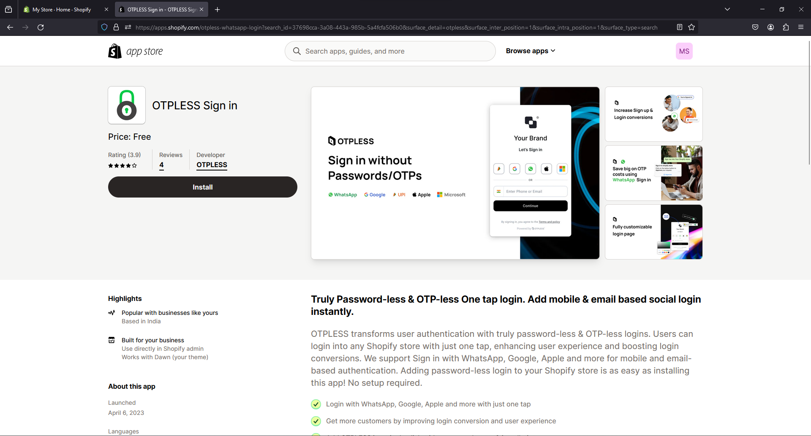

<h1>OTPless WordPress Integration</h1>

### Step 1 : Install OTPless WordPress Plugin

- Click [here](https://wordpress.com/plugins/otpless) or Navigate to `Add New Plugins` Search for `otpless` and **install** it.

### Step 2 : Activate Plugin

- Click on `Activate Plugin` and **Activate** it.

### Step 3 : Configure Plugin

- Navigate to `Settings>OTPless` and choose your desired integration options.

    

    
Expand to Preview OTPless Settings

    
    

### Step 4 : Finally You can visit OTPless Dashboard for further configuration.

- Visit [OTPless Dashboard](https://otpless.com/dashboard/app) and signup with an ***email address associated with the domain of your WordPress site*** where you are planning to integrate OTPless Authentication.

- Navigate to Settings for your app and customize your integration.

<h1>OTPless Shopify Integration</h1>

### Step 1 : Install OTPless Shopify Plugin

- Visit [this link](https://apps.shopify.com/otpless-whatsapp-login) and install `OTPless Sign in` plugin.

    
    

### Step 2 : Activate Plugin

- After installing, you will be redirected to the OTPless plugin settings.

    

- Navigate to the `App Embeds` page, by clicking on the link in Step 2 in the plugin settings page and **Turn On** `OTPless`.

    

<h2>OTPless Authentication Page</h2>

### Thats it for OTPless login page integration

- In a new tab visit `{YOUR_STORE_DOMAIN}.com/account/' and you will be redirected to the OTPless login page.

    

<h2>OTPless Authentication Widget</h2>

### Follow the steps below to add OTPless widget in your login page.
> It can be integrated in any page.

### Step 3 : Deactivate default redirection

- Go to `OTPless plugin settings` page and expand the first question in the `Frequently Asked Questions` section and toggle the button on the right **OFF**. This deactivates the default redirection to OTPless authentication page.

    

- If you want a floating OTPless widget in your login page, you can skip the rest of this guide. Your `Login` page will look like this, you get a floating OTPless authentication widget:

    

### Step 4 : Add OTPless Widget to Login Page

- Navigate to `Online store>Themes` and click `Customize` on your current theme.

    

- From the Page Selection dropdown, navigate to `Classic customer accounts>Customer login` page.

    

- Hide the `Login` component from the Template section.
- Add OTPless Widget by clicking on `Add Section>Apps>OTPLESS Sign In`.

    
    

- Thats it. Save the changes. and visit your account page `{YOUR_STORE_DOMAIN}.com/account/login` to see the OTPless widget embedded in your login page.

    > LogIn Page
    
    > Account Page
    

> Similarly, you can add OTPless widget in any page.

### Step 5 : Finally You can visit OTPless Dashboard for further configuration.

- Visit [OTPless Dashboard](https://otpless.com/dashboard/app) and signup with an ***email address associated with the domain of your Shopify store*** where you are planning to integrate OTPless Authentication.

- Navigate to Settings for your app and customize your integration.
